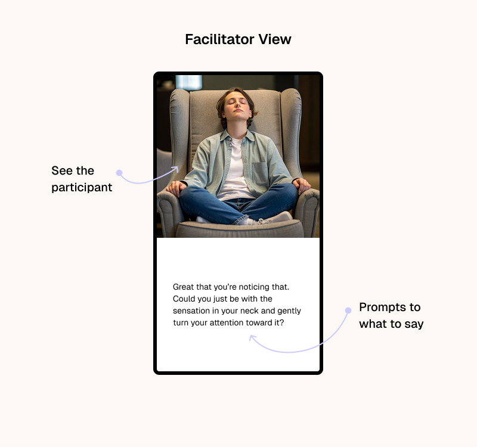
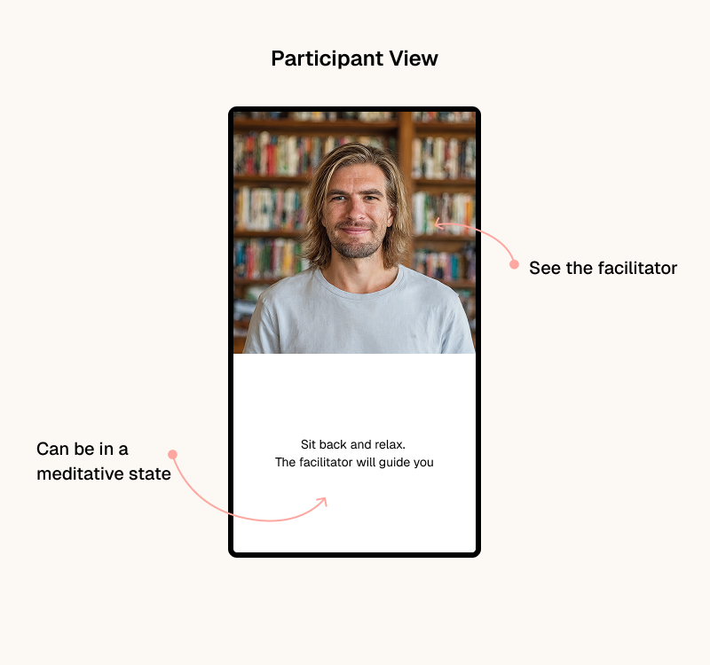
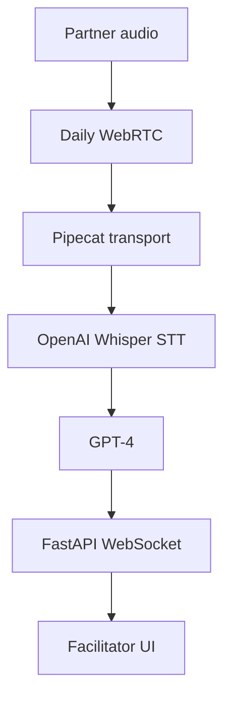

# No Bad Parts — Silent Coach Demo 🎥🧠

[](./LICENSE)

A two-URL proof-of-concept showing how a backstage AI "Silent Coach" can assist an Internal&nbsp;Family&nbsp;Systems (IFS) session in real time.





---
## What it does

1. The **Partner** joins a Daily video room and speaks naturally.
2. A **silent Agent** (Python + Pipecat) joins as `ai-coach`, captures _only_ the Partner's audio and streams it to OpenAI Whisper for speech-to-text.
3. The transcript plus recent context is fed to GPT-4 which returns a short IFS-style coaching hint.
4. Hints are pushed over a FastAPI WebSocket to every open **Facilitator** page, updating a live sidebar next to the video.

This gives the facilitator real-time, private suggestions without interrupting the partner's flow.

---
## Live endpoints (after deploy)

• Vercel front-end
  – `/session/partner` Full-screen Daily call for the participant  
  – `/session/facilitator` Video + "Coach Panel" with streaming hints

• Fly.io agent
  – `wss://<app>.fly.dev/ws` JSON stream of hint messages

---
## Pipeline at a glance



---
## Tech stack

• **Next.js 14** (Pages Router) + **Tailwind CSS / shadcn/ui**  
• **Daily Prebuilt** iframe for instant video  
• **Pipecat** orchestrating Whisper → GPT-4  
• **FastAPI + WebSocket** for real-time delivery  
• **Fly.io** (agent) & **Vercel** (front-end) for zero-config deploys

---
## Quick start (local)

### 1  Clone & install
```bash
git clone https://github.com/<your-org>/no-bad-parts.git
cd no-bad-parts
pnpm install
```

### 2  Environment
```bash
# .env.local (front-end)
NEXT_PUBLIC_DAILY_URL=https://your-room.daily.co/ifs-demo

# .agent.env (backend)
DAILY_ROOM_URL=https://your-room.daily.co/ifs-demo
OPENAI_API_KEY=sk-…
```

### 3  Run it
```bash
# Terminal A – Next.js
pnpm dev

# Terminal B – AI agent
cd agent
python -m venv .venv && source .venv/bin/activate
pip install -r requirements.txt
python server.py
```
Open:
- http://localhost:3000/session/partner  (participant view)
- http://localhost:3000/session/facilitator  (facilitator view)

Speak in the Partner tab – hints should appear within ~2 s.

---
## Roadmap & build-plan milestones

The short-term milestones that got us here:

1. Scaffold repo, two session pages, FastAPI shell.  
2. Daily Prebuilt working on both pages.  
3. WebSocket echo channel.  
4. Pipecat transport → Whisper → GPT-4 → broadcast hints.  
5. Deploy agent to Fly, UI to Vercel.

Detailed notes live under `references/buildplan_parts/`.

---
## Expected outcome

By the end you have:

• Two public URLs on Vercel (`/partner` & `/facilitator`).  
• A Fly-hosted agent at `wss://<app>.fly.dev/ws` that silently listens, thinks, and streams hints.  
• Incremental test checkpoints for each layer (video, WS, STT, LLM).

---
## License

MIT – free to use, modify & sell. PRs welcome!
